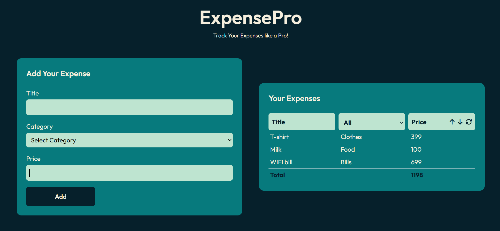

# ExpensePro

[](https://app.netlify.com/sites/expense-pro/deploys)


ExpensePro is a React project designed to help users manage and track their expenses easily. This application integrates modern UI design, local storage persistence, and a user-friendly experience for efficient expense management.

---

## 🌐 Live Project

Check out the live project 👉 [ExpensePro](https://expense-pro.netlify.app/)


## 🚀 Features

### Core Features

- **Expense Management**:
  - Add, edit, and delete expenses (title, category, price).
- **Data Filtering**:
  - Filter expenses by category.
  - Sort expenses by price (ascending/descending).
- **Context Menu**:
  - Custom right-click menu for edit/delete actions.
- **Local Storage Integration**:
  - Persistent data saving and auto-loading.
- **Form Validation**:
  - Required field validation and price input validation.
- **Dynamic Data Update**:
  - Live UI updates with total expense calculation.
- **Responsive Design**:
  - Fully mobile and desktop friendly using Tailwind CSS.
- **User-Friendly Interface**:
  - Clean input forms, buttons, and interactive UI.

---

## 🛠️ Technologies Used

- **React.js**: Frontend development
- **Tailwind CSS**: Styling and responsive layout
- **Vite**: Build tool and development server
- **Netlify**: Deployment

---

## 💡 Skills Enhanced

- React Component Architecture and State Management
- Local Storage Data Persistence
- Custom Hooks in React
- Tailwind CSS Styling and Responsive Layouts
- Form Validation and Error Handling
- Netlify Deployment and Vite Configuration

---

## 📂 Project Structure

```
ExpensePro/
├── node_modules/          # Installed dependencies  
├── public/                # Static assets  
├── src/  
│   ├── assets/            # Images or other static resources  
|   |   ├── ss.png 
│   ├── components/        # React components  
│   │   ├── ContextMenu.jsx  
│   │   ├── Form.jsx  
│   │   ├── Input.jsx  
│   │   ├── Select.jsx  
│   │   └── Table.jsx  
│   ├── hooks/             # Custom React hooks  
│   │   ├── useFilter.js  
│   │   └── useLocalStorage.js  
│   ├── App.jsx            # Main application file  
│   ├── main.jsx           # Entry point  
│   ├── index.css          # Global CSS styles  
├── .gitignore             # Git ignored files  
├── eslint.config.js       # ESLint configuration  
├── index.html             # HTML template  
├── package-lock.json      # Dependency lock file  
├── package.json           # Project metadata and dependencies  
├── postcss.config.js      # PostCSS configuration  
├── tailwind.config.js     # Tailwind CSS configuration  
├── vite.config.js         # Vite configuration  
└── README.md              # Project documentation

```
## ⚙️ Installation and Setup

1. **Clone the Repository**
   ```bash
   git clone https://github.com/Angshu09/Expense_Tracker.git
   ```

2. **Navigate to the Project Directory**
   ```bash
   cd Expense_Tracker
   ```

3. **Install Dependencies**
   ```bash
   npm install
   ```

4. **Start the Development Server**
   ```bash
   npm run dev
   ```

5. Open your browser and navigate to `http://localhost:5173/` to explore ExpensePro.
 
## 📸 Screenshots

### Home Page



---

Developed by **Angshu Das**.